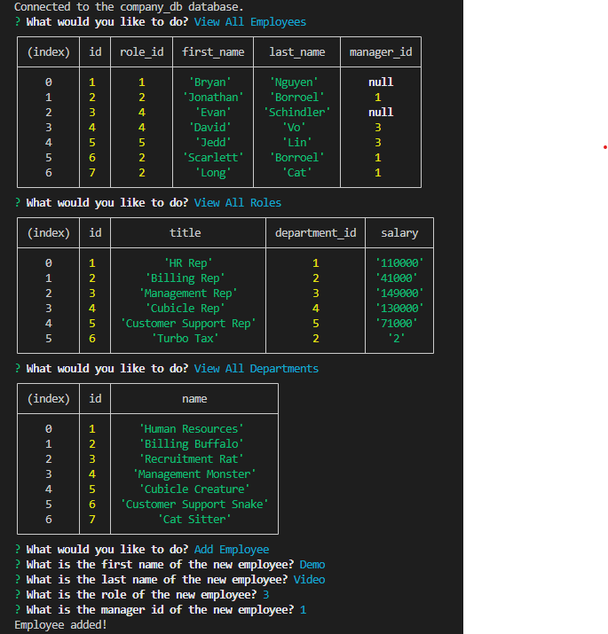

# Company Database Tracker

[License](https://opensource.org/licenses/MIT)

## Table of Contents
    
- [Description](#description)
- [Installation](#installation)
- [Usage](#usage)
- [License](#license)
- [Author](#author)
- [Contributors](#contributors)
- [Tests](#tests)
- [Questions](#questions)
    
## Description
    
This project allows the user to be prompted to view departments, roles, employees of the company. It also allows the user to add new employees, roles, and departments, and update the role of a specific employee.
    
[Link to walkthrough demo of application](https://drive.google.com/file/d/1Ob-Dn1j2khkRTwSN7ygyclNTPHdIzib1/view)
    
## Installation
    
To use this project, navigate to the GitHub repository and clone the repository down to your local machine. Run the contents of db in mysql. Navigate to main and run node index.js.
    
## Usage
    
To use the project after installation, run node index.js. Select from the given prompts and follow the instructions on the terminal.
    
## License
    
Copyright <2023> 

    Permission is hereby granted, free of charge, to any person obtaining a copy of this software and associated documentation files (the “Software”), to deal in the Software without restriction, including without limitation the rights to use, copy, modify, merge, publish, distribute, sublicense, and/or sell copies of the Software, and to permit persons to whom the Software is furnished to do so, subject to the following conditions:
    
    The above copyright notice and this permission notice shall be included in all copies or substantial portions of the Software.
    
    THE SOFTWARE IS PROVIDED “AS IS”, WITHOUT WARRANTY OF ANY KIND, EXPRESS OR IMPLIED, INCLUDING BUT NOT LIMITED TO THE WARRANTIES OF MERCHANTABILITY, FITNESS FOR A PARTICULAR PURPOSE AND NONINFRINGEMENT. IN NO EVENT SHALL THE AUTHORS OR COPYRIGHT HOLDERS BE LIABLE FOR ANY CLAIM, DAMAGES OR OTHER LIABILITY, WHETHER IN AN ACTION OF CONTRACT, TORT OR OTHERWISE, ARISING FROM, OUT OF OR IN CONNECTION WITH THE SOFTWARE OR THE USE OR OTHER DEALINGS IN THE SOFTWARE.
    
## Author
    
David Chung
[GitHub](https://github.com/dchung13/)
    
## Contributors
Special thanks to:  

David Vo  
[GitHub](https://github.com/daevidvo)  

Bryan Nguyen  
[GitHub](https://github.com/bryannguyen9)  
    
## Tests
    
N/A
    
## Questions
If you have any questions, my GitHub is [GitHub](https://github.com/dchung13/).
You can also reach me by email at [dchung20315@gmail.com](dchung20315@gmail.com).
